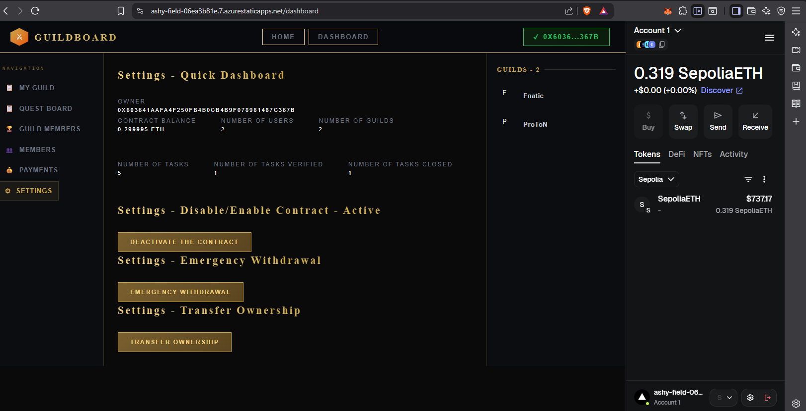
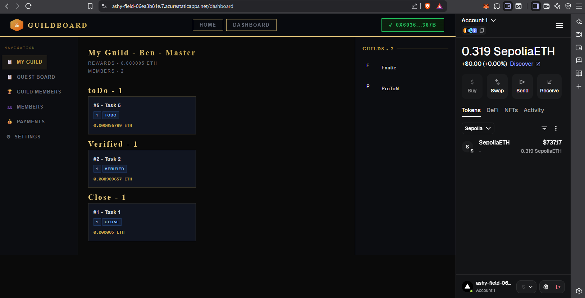

# GuildBoard

A decentralized task marketplace for on-chain communities.

GuildBoard lets DAOs and guilds:

- assign tasks
- track progress
- pay contributors in ETH — automatically and trustlessly

Built with upgradeable smart contracts and a real-time React frontend.

---

## 🚀 Demo

🔗 Live: https://ashy-field-06ea3b81e.7.azurestaticapps.net

---

## 🖼 Preview




---

## 🧠 Why This Project

Traditional task boards rely on trust in centralized systems.

GuildBoard solves this by:

- storing guild, member, and task state on-chain
- enforcing workflow rules via smart contracts
- handling ETH payouts directly from the contract
- providing full transparency through a Web3 dashboard

---

## ⚙️ Core Features

### Smart Contracts

- **Two upgradeable UUPS contracts: `GuildNFT` and `Guildboard`**
  - `GuildNFT`: manages guilds and members as ERC-721 tokens
  - `Guildboard`: handles tasks, lifecycle, deposits, and ETH payouts
- Security patterns:
  - `ReentrancyGuard`
  - `Pausable`
  - `Ownable`
- Full test suite with Hardhat + Mocha/Chai

---

## 🔐 Permission Model

GuildBoard uses a hybrid permission system.

### 👑 Owner

- Pause / unpause the contract (emergency control)
- Withdraw or manage contract balance
- Transfer ownership
- Perform system-level administration

### 👤 Community Users

- Create tasks on-chain
- Update task lifecycle:
  - `toDo → inProgress → Done → Verified → Closed`
- Mint a member NFT (user registration)
- Join and participate in guilds

> GuildBoard is designed as a collaborative decentralized system, not just an admin-controlled board.

---

## 🧩 Contract Details

### GuildNFT (ERC-721 Upgradeable)

- Create and manage guilds
- Mint member NFTs
- Assign users to guilds
- Manage roles and membership
- Query relationships between users and guilds

---

### Guildboard (Upgradeable Task System)

- Create and manage tasks
- Assign tasks to members
- Track full task lifecycle
- Deposit ETH into contract treasury
- Automatically pay assignees on completion
- Emergency pause/unpause

---

## 💻 Frontend

- Wallet connection via Wagmi + RainbowKit
- Dashboard for guilds, members, and tasks
- Contract settings panel (pause, ownership, balance)
- Real-time updates using:
  - `useWatchContractEvent`
  - `useWaitForTransactionReceipt`
- Role-based UI (owner vs user)
- Deployed on Azure Static Web Apps

---

## 🛠 Tech Stack

- Solidity 0.8.28
- Hardhat + TypeScript
- OpenZeppelin Upgradeable Contracts
- Ethers v6
- Wagmi + Viem + RainbowKit
- Next.js (App Router) + TypeScript

---

## 📁 Project Structure

```text
guildboard/
  contracts/
    contracts/
      GuildNFT.sol
      Guildboard.sol
    scripts/
      deploy.ts
      upgrade.ts
    test/
      GuildNFT.test.ts
      Guildboard.test.ts

  frontend/
    src/
      app/
      components/
      hooks/
      contracts/
```
